# VizFaculty - Visiting Faculty Salary Management App

VizFaculty is a user-friendly and interactive web application that automates the salary and lecture management system of visiting faculty members. The application is designed to streamline the process of managing salaries and lectures by eliminating the need for paper-based records. The application provides a centralized system to manage visiting faculty members' details and generate their salary slips automatically.

## !!! Important

For backend of Vizfaculty [click on this](https://github.com/Saifkhan-rkp/VizFaculty-Backend) 
use .env.example file for env reference
routes for dashboards are -

[http://localhost:3000](http://localhost:3000)  - Landing page
        
### login required routes

[http://localhost:3000/faculty](http://localhost:3000/faculty)  - for faculty
[http://localhost:3000/dept](http://localhost:3000/Dept)  - for HoD 
[http://localhost:3000/adminDept](http://localhost:3000/AdminDept)  - for Admin Department

## Available Scripts

In the project directory, you can run:

### `npm start`

Runs the app in the development mode.\
Open [http://localhost:3000](http://localhost:3000) to view it in your browser.

The page will reload when you make changes.\
You may also see any lint errors in the console.

### Home Page After Login

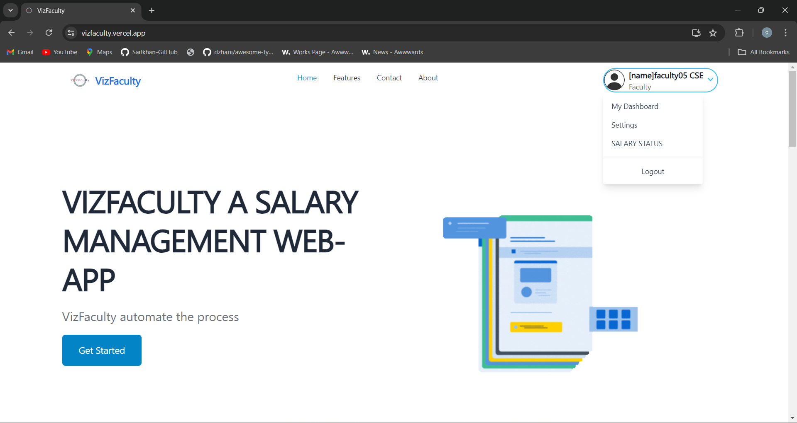

### Admin Department (College Level)

  

    
    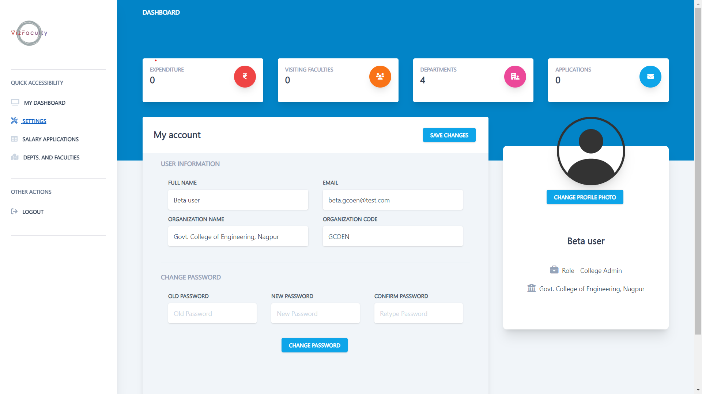
  

  

    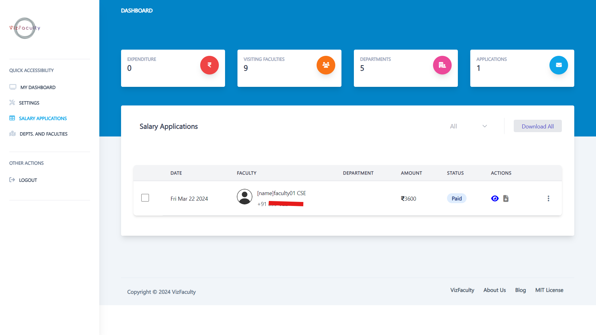
    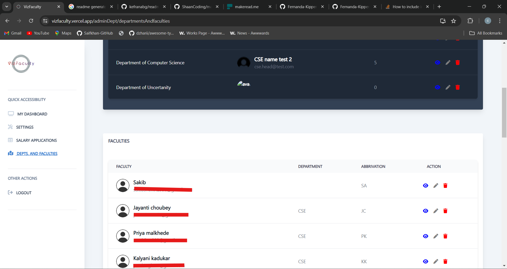
  

### Department (HoD)

  

    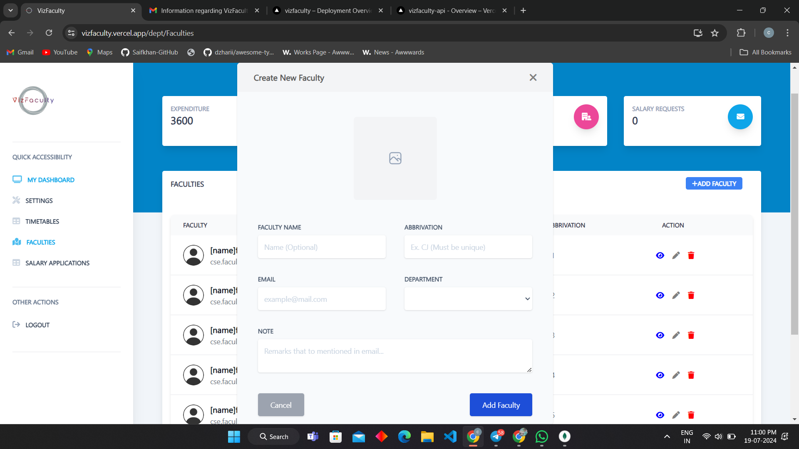
    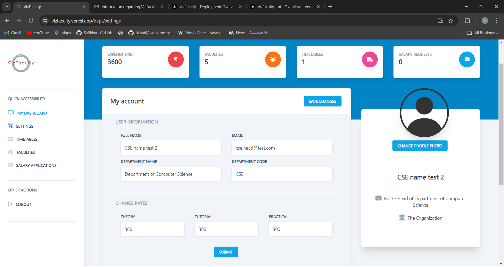
  

<b>Salary Applications Page</b>

  

    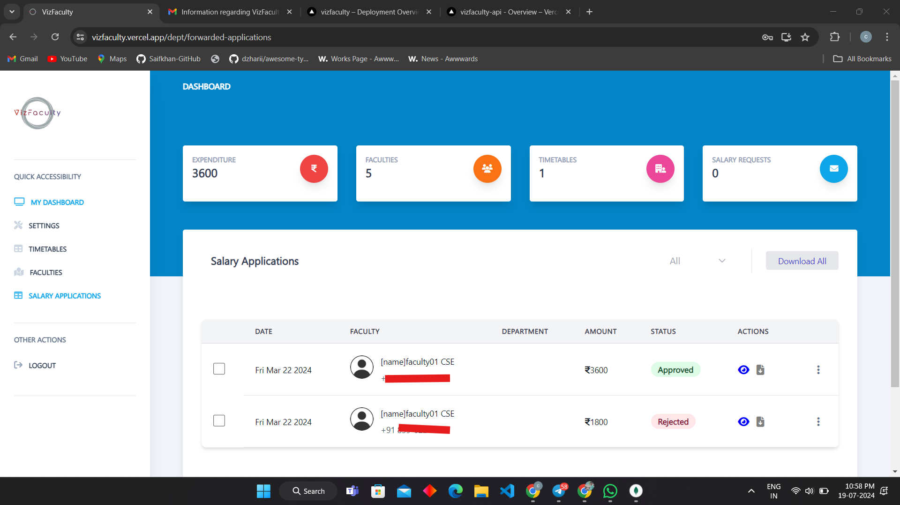
    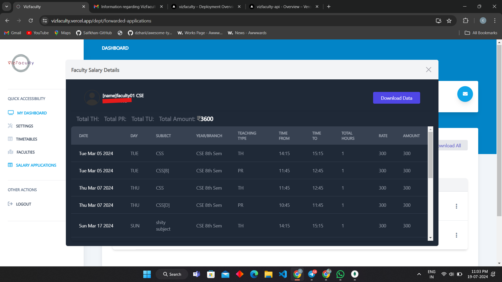
  

<b>Timetables Page</b>

  

    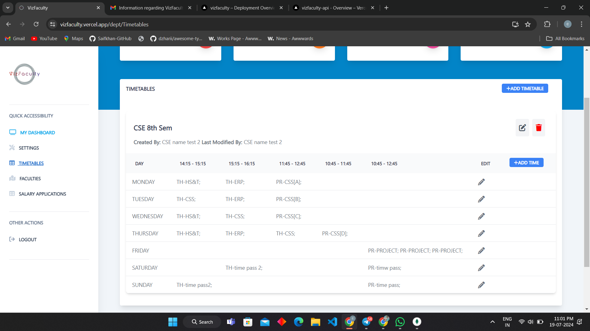
    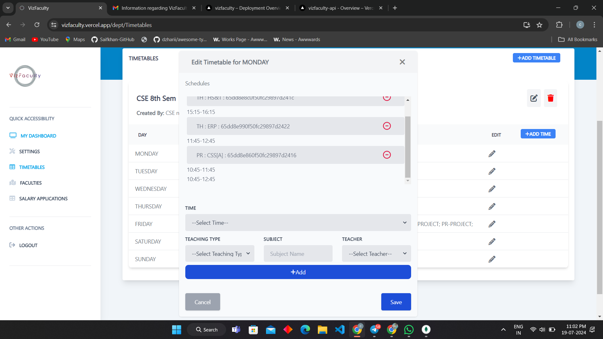
  

### Faculty

<b>Faculty Dashboard </b>

  

    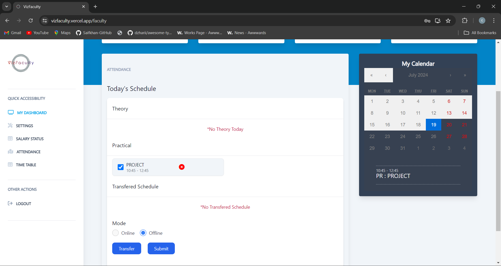
    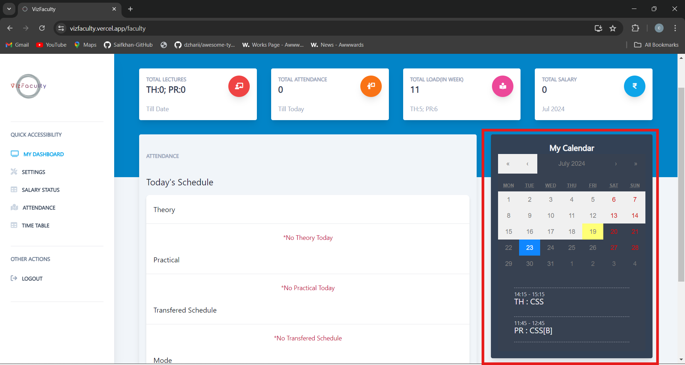
  

<b>Schedule Transfer</b>

  

    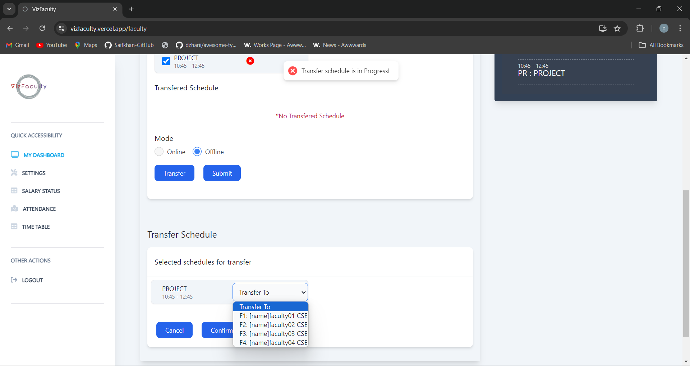
    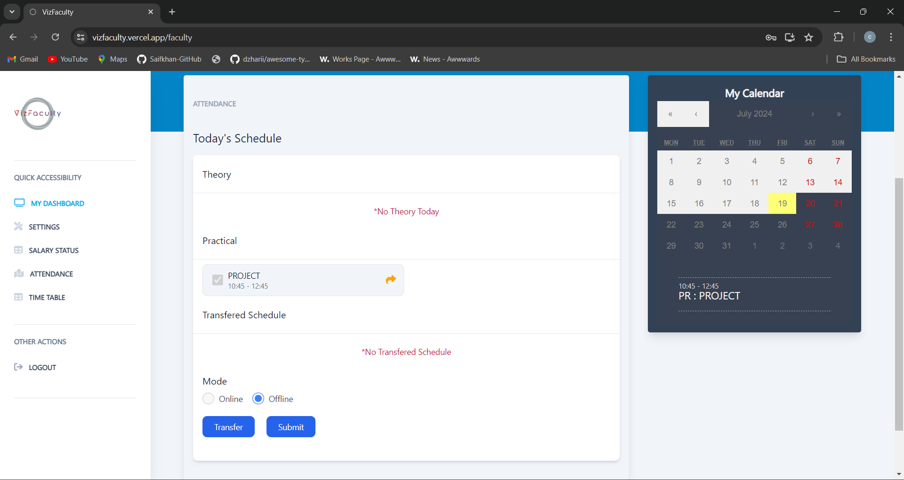
  

  

    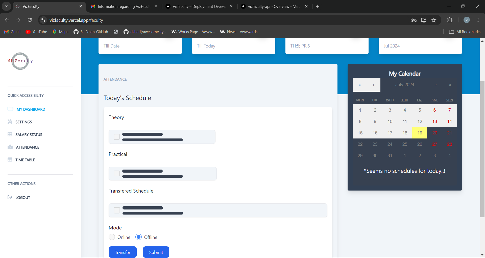
    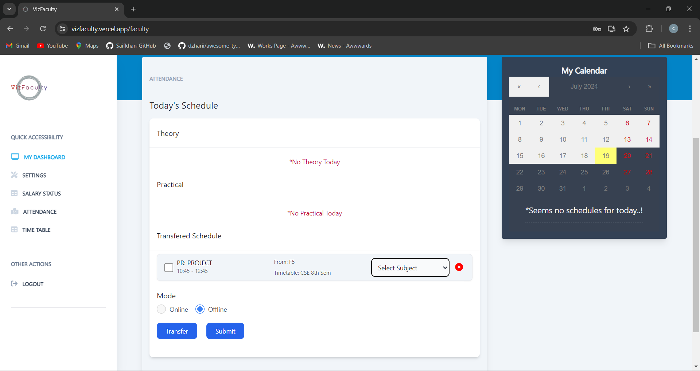
  

<b>Salary status page</b>

  

    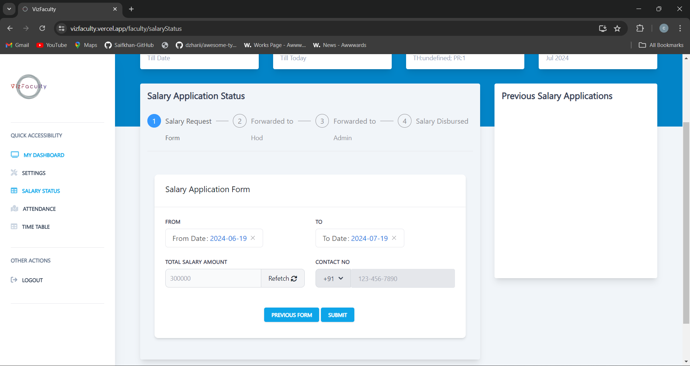
    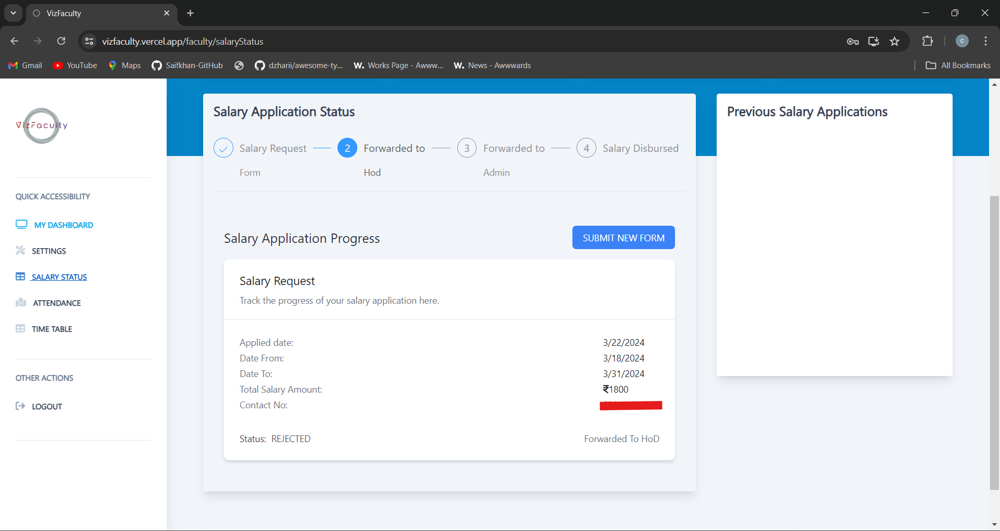
  

